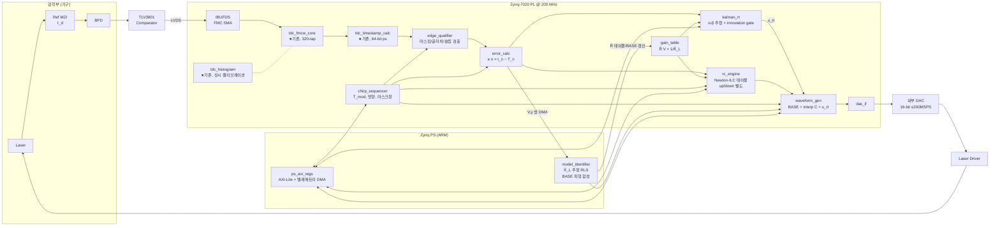

# EO-PLL 제어 블록 설계 (ZedBoard, 완전 디지털 파형직접출력 방식)

> 2026-07-22 초안 → **v2: 차별화 풀 패키지 반영** (differentiation_strategy.md 참조).
> 근거: Hauser 2022 (수식/RC 구조), Schnuck 2025 (파형 액추에이터 구조), 본 저장소 TDC 코드 실측 결과.
> v2 추가: ① chirp-agile 역모델 학습(주 기여), ② Newton-ILC 가변이득, ③ 칼만 실시간 경로 + innovation gating.

---

## 1. 시스템 파라미터 (설계 기준값)

| 항목 | 값 | 비고 |
|---|---|---|
| 시스템 클럭 | 200 MHz (T_clk = 5 ns) | 기존 TDC와 동일 도메인 |
| Beat 주파수 f_b | ≤ 20 MHz (T_b ≥ 50 ns) | MZI 설계로 결정 |
| 변조 파형 | 삼각파, T_mod = 100~400 µs (프로그래머블) | 예시 계산은 200 µs (5 kHz) |
| DAC | ≤ 200 MSPS, **16-bit 권장** | 부품 미정 (§8 결정 대기) |
| TDC 분해능 | ~15.6 ps/tap (320 taps / 5 ns), 캘리브레이션 후 | 기존 tdc_fmcw_core 실측 기반 |
| TDC dead time | 3 clk = 15 ns | 50 ns beat 주기 처리 가능 ✅ |
| chirp당 에지 수 N | f_b·T_mod/2 = 최대 ~4000 | 보정 테이블 depth 4096 |

**제어 수식 (v2 — 풀 패키지):**
```
[측정]   e(n)      = t_n − T_n ,   T_n = t_anchor + n·T_b     … TDC 위상오차
         ν_nl(t_n) = −γ·e(n)                                   … 주파수오차 복원

[식별]   K̂_L(V)   = dν/dV 전압 구간별 추정 (PS, RLS/구간평균)  … chirp 독립 레이저 역모델
         R̂(V)     = 1/K̂_L(V) 역이득 테이블 (PL BRAM, 나눗셈 회피)

[학습]   C_{k+1}[j] = Q{ C_k[j] + clamp(R̂(V[j])·γ·e_k(j+D)) }  … Newton-ILC (전 구간 균일 수렴)

[실시간] x̂ = [φ̂; f̂] 칼만(α-β) 추정, 측정잡음 R = TDC 히스토그램 실측 분산
         u_rt(n) = −(L_φ·φ̂ + L_f·f̂)·R̂(V)                      … 비반복 외란 억제
         gate: |innovation| > λ·σ → 측정 기각, 예측만 전파      … cycle-slip 통계 판정

[합성]   DAC[m]  = BASE[m] + interp(C[j(m)]) + u_rt (+ d_inj)  … d_inj = 외란주입 실험용
[재잠금] chirp 설정(B', T'_mod) 변경 → BASE[m] = V(ν_ideal(m)) 역모델 합성 → RC 잔차만 수렴
```
역할 분담: **RC = 반복 오차** (chirp마다 재현되는 비선형성), **칼만 = 비반복 오차** (진동/잡음),
**역모델 = 저주파 구조** (chirp 설정이 바뀌어도 유지되는 레이저 고유 특성) — 3층 분리가 논문의 서사.

---

## 2. 최상위 블록도



ASCII 버전 (미리보기가 mermaid를 지원하지 않을 때):

```
 Laser ──► MZI(τ_d) ──► BPD ──► TLV3801 ──LVDS/SMA──► IBUFDS
                                                        │ hit
   ┌────────────────────────────────────────────────────▼─────────┐
   │  FPGA (200 MHz 단일 도메인)                                    │
   │  tdc_fmcw_core ─► tdc_timestamp_calc ─► edge_qualifier        │
   │   (★기존)           (★기존, 64b ps)        │ t_n, n           │
   │                                          error_calc ──┬────┐  │
   │        chirp_sequencer ──(방향/마스크/동기)──┤  e(n)     │    │  │
   │              │                     rc_engine       kalman_rt │
   │              │                  (Newton-ILC ×2) ◄─ gain_table│
   │              ▼                         │               │u_rt │
   │        waveform_gen ◄── interp(C[j]) ──┴───────────────┘     │
   │              │ BASE[m] + corr + u_rt                         │
   │           dac_if          ▲                                  │
   └──────────────┼────────────┼──────────────────────────────────┘
                  ▼            │ R̂ 테이블/BASE 합성
            DAC(16b) ─► ...    PS(ARM): model_identifier (V,γ 쌍 DMA 수신, RLS)
```

---

## 3. 모듈별 사양

### 3.1 재사용 모듈 (기존 코드)

| 모듈 | 역할 | 변경사항 |
|---|---|---|
| [tdc_fmcw_core.v](../tdc_fmcw_core.v) | 캐리체인 TDC (coarse 32b + fine 9b) | 없음. hit 입력만 IBUFDS 출력으로 연결 (hit 네트에 다른 부하 금지 — LED 교훈 유지) |
| [tdc_timestamp_calc.v](../tdc_timestamp_calc.v) | 캘리브레이션 ROM 적용, 64-bit 절대시간(ps) | 없음 |
| [tdc_histogram.v](../tdc_histogram.v) | code-density 캘리브레이션 | 운용 중 주기적 재캘리브레이션 경로로 승격 (온도 드리프트 대응) |
| [phase_shifter.v](../phase_shifter.v) | MMCM 위상 스윕 (INL 검증) | 검증 전용 유지, 제어 루프 미포함 |
| tdc_test_top.v | 테스트 하니스 | `eopll_top.v`(신규)로 대체, Mode 2 경로만 계승 |

### 3.2 edge_qualifier (신규)

TDC 타임스탬프를 제어에 쓸 수 있는 "유효 에지"로 거른다.

```
입력 : timestamp_ps[63:0], ts_valid, chirp 상태(방향, mask_active), 파라미터(T_b, mask폭)
출력 : t_n[63:0], edge_valid, edge_idx n[12:0], slip_flag, chirp_abort
```

| 기능 | 규칙 |
|---|---|
| 꼭짓점 마스킹 | chirp_sequencer의 `mask_active` 구간(꼭짓점 전후 M beat 주기, 프로그래머블) 동안 에지 폐기 + `edge_idx` 리셋/재앵커 |
| 글리치 제거 | Δt = t_n − t_{n−1} < T_b/4 → 폐기 (비교기 chatter) |
| cycle-slip 검출 | 1차 판정은 kalman_rt의 innovation gate(통계 검정)가 담당. 본 모듈의 \|Δt − T_b\| > T_b/2 휴리스틱은 **KF 미동작 구간(브링업 1단계, 앵커 직후)의 폴백**으로 유지. slip 확정 시 해당 chirp의 RC 갱신 무효화(`chirp_abort`) |
| 에지 카운트 | 마스크 해제 후 첫 에지를 n=0 앵커로, 이후 n++ |

### 3.3 error_calc (신규)

```
입력 : t_n, edge_valid, n, 파라미터 T_b(Q32.16 ps)
출력 : e_n[23:0] signed (ps, 포화), seg_addr j[12:0], e_valid
```

- 기대시각은 곱셈 없이 **누산기**로 생성: `T_acc += T_b` (Q48.16). T_b의 16-bit 소수부가 없으면 4000 에지 누적 시 최대 ±2 ns 계통오차 발생 → 소수부 필수.
- 앵커: chirp마다 첫 유효 에지에서 `T_acc = t_0` 재설정 (절대 오프셋 제거, 논문1 방식).
- `e_n = t_n − T_acc`, ±2²³ ps (±8.4 µs) 포화.
- `j = n` (에지 1개 = 보정 세그먼트 1개).

### 3.4 rc_engine (신규) — 학습 핵심 (v2: Newton-ILC)

```
입력 : e_n, e_valid, j, 방향(up/down), chirp_abort, R̂[V] (gain_table), 파라미터 K_RC(Q0.16), D_edge[7:0], α1(Q0.8)
출력 : corr_rd_data C[j] (Q16.9 signed, 25b), (재생용 read port)
BRAM : 테이블 2개(up/down) × 4096 × 25b ≈ 205 kb ≈ 6× RAMB36 (7020 총 140개 — 여유)
```

- **갱신 (에지마다, RMW)**: `C[j − D_edge] += clamp(R̂(V[j]) × K_RC × e_n) >>> 16`
  - **Newton형 가변이득**: 역이득 R̂(V)로 나눗셈 없이 `e/K̂_L` 실현 → K_L이 수 배 변하는 전류 구간에서도 균일 수렴률.
  - **발산 방지 클램프**: 유효 이득을 공칭 K_RC의 0.5~2.0배 범위로 제한 (모델 국소 오차 대비). R̂ 테이블 미준비 시(브링업 초기) R̂=1 고정 → v1의 고정이득 ILC로 동작 (ablation 비교군을 겸함).
  - 루프지연 보상 D_edge = 전체 루프지연 ÷ T_b (에지 단위). 디지털 지연(TDC 10단 + qualifier/error ~4단 ≈ 70 ns)보다 **레이저 열응답 지연이 지배적**이므로 D_edge는 실측 후 레지스터로 튜닝.
  - 에지 간격 ≥ 10 clk, RMW는 3 clk → 처리량 여유 3배 이상.
- **Q-filter (chirp 경계에서 스무딩 패스)**: `C'[j] = α₁·C[j−1] + α₀·C[j] + α₁·C[j+1]`, `2α₁+α₀=1`
  - 4096 엔트리 패스 = 20.5 µs. 꼭짓점 마스크 창(수 µs)보다 길 수 있으므로 **재생 포인터보다 앞서 달리는 스트리밍 패스**로 구현 (경계 직후 j=0부터 순차 진행, 재생은 세그먼트당 ~10 DAC 샘플이라 추월 불가능 — 마진 계산: 패스 1 엔트리/clk vs 재생 1 엔트리/10 clk).
- **DC 앵커링**: 패스 중 이동합으로 평균 계산 → 다음 chirp에 평균 제거. 파형이 mode-hop-free 창을 이탈하는 드리프트 차단.
- `chirp_abort` 시 해당 chirp의 갱신분 롤백은 하지 않고 **갱신 자체를 건너뜀** (단순화 — slip은 드물고 다음 chirp이 복구).

### 3.4b gain_table (신규, v2) — 역이득 테이블

```
BRAM : 256 × 16b (Q1.15), 주소 = 현재 BASE[m] 상위 8b (전압 구간)
내용 : R̂(V) = 1/K̂_L(V) 정규화값. PS(model_identifier)가 AXI로 갱신, ping-pong 2면
```
- 나눗셈을 PL에서 제거하기 위해 **역수를 PS에서 미리 계산**해 내려보낸다.
- rc_engine(학습 이득)과 kalman_rt(출력 스케일)가 공유.

### 3.4c kalman_rt (신규, v2) — 실시간 경로 (비반복 외란)

```
입력 : e_n, e_valid (에지마다), 파라미터 L_φ, L_f (Q0.16), λ_gate, σ (히스토그램 실측)
출력 : u_rt (16b signed, waveform_gen으로), slip_detect, innov_stream (텔레메트리)
상태 : x̂ = [φ̂(위상오차); f̂(주파수오차)] — 2상태 정상상태 칼만 = α-β 추적기
```
- **예측**: `φ̂ ← φ̂ + f̂·T_b`, **갱신**: `innov = e_n − φ̂`; `φ̂ += L_φ·innov`; `f̂ += L_f·innov`
  - 곱셈 4회/에지, DSP 1개 — 에지 간격 10 clk 대비 여유.
  - L_φ, L_f는 정상상태 칼만 이득을 PS에서 오프라인 계산 (R = TDC 캘리브레이션 히스토그램의 실측 분산 — **잡음 모델을 측정으로 아는 것이 차별점**).
- **Innovation gating**: `|innov| > λ·σ_innov` → 측정 기각, 예측만 전파, `slip_detect` 카운트.
  연속 G회 기각 시 chirp_abort 요청 (통계적 cycle-slip 판정 — edge_qualifier 휴리스틱을 대체).
- **출력**: `u_rt = −(L_out,φ·φ̂ + L_out,f·f̂)·R̂(V)`. 대역 제한: 레이저 FM 위상반전 주파수 아래로 L_out 설계 (외란주입 실험으로 실측 후 확정).
- 에지 누락(마스크 구간 포함) 시 예측만으로 관성 유지 → 꼭짓점 통과 직후 재수렴 가속.

### 3.5 chirp_sequencer (신규)

- T_mod 카운터, up/down 방향, `chirp_start`/`apex` 스트로브, 꼭짓점 전후 마스크 창 생성.
- **T_mod 고정** (논문2와 달리 주기 불변 — DC 자유도는 rc_engine의 앵커링이 흡수).
- v2: chirp 설정 레지스터(B', T'_mod)는 **더블버퍼** — PS가 새 설정+새 BASE를 준비 완료 후 chirp 경계에서 원자적 전환 (chirp-agile 실험의 핵심 메커니즘).

### 3.5b model_identifier (신규, v2) — PS(ARM) 소프트웨어, 주 기여

```
입력 : (V[j], γ_meas[j]) 쌍 스트림 (DMA) — γ_meas[j] = 1/(τ_d·Δt_j), V[j] = 해당 시점 DAC값
출력 : ① R̂(V) 역이득 테이블 → gain_table  ② BASE[m] predistortion 파형 → waveform_gen
       ③ 유효 전압 범위 [V_min, V_max] (mode-hop 가드)
```
- **식별**: 전압축을 256 구간으로 나눠 K̂_L(V) = Δγ/ΔV 구간별 RLS(망각계수 λ_RLS) 추정.
  up/down chirp 대칭성 비교로 열지연 성분 분리 (비대칭 잔차 = 1차 열모델 τ_th 추정).
- **파형 합성 (chirp-agile 재잠금)**: 목표 ν_ideal(t) (임의 B', T'_mod, 파형모양) →
  `V(t) = K̂_L 역함수 적분` 수치합성 → BASE BRAM 기록 → 더블버퍼 전환.
  RC 테이블은 전환 시 0으로 클리어 (모델 오차 잔차만 새로 학습 — 1~2 chirp 수렴이 논문 주장).
- 실행 주기: chirp마다 데이터 수집, 모델 갱신은 ~100 chirp 이동창 (실시간성 불요 — PS로 충분).

### 3.6 waveform_gen (신규, v2)

```
출력 합성: DAC[m] = BASE[m] + C_interp(m) + u_rt (+ d_inj)   → 16b 포화 + [V_min,V_max] 가드
```

- **BASE**: BRAM 표준 (PS의 model_identifier가 합성한 predistortion 파형, 더블버퍼 ping-pong).
  브링업 초기(모델 미확보)엔 위상 누산기 삼각파 폴백.
- **보정 보간**: 세그먼트 진행 누산기 `frac += T_s/T_b` (Q0.16) → `C_interp = C[j]·(1−frac) + C[j+1]·frac`. 세그먼트당 ~10 DAC 샘플의 계단을 제거.
- **u_rt**: kalman_rt 출력 (v1의 K_P 경로 대체).
- **d_inj**: 외란주입 포트 — DDS 정현파 (주파수/진폭 레지스터) 가산. Schnuck Fig.10 방식의 외란억제 대역폭 실험용 (논문 비교 데이터 생성).
- **범위 가드**: model_identifier가 준 [V_min, V_max] 이탈 시 포화 + 플래그 (mode-hop 방지).

### 3.7 dac_if (신규, 부품 확정 후)

- 병렬 CMOS/LVDS 16-bit, 클럭은 200 MHz 계열 정수분주(50~200 MSPS)로 **동일 MMCM에서 생성 → CDC 없음**.
- 요구: 단조성(글리치 에너지 낮을 것), 정착시간 < T_b.

### 3.8 ps_axi_regs (신규)

| 레지스터 | 용도 |
|---|---|
| T_b, T_mod, 마스크폭 M | 루프 상수 (더블버퍼 — chirp 경계 원자 전환) |
| K_RC, α₁, D_edge | Newton-ILC 튜닝 |
| L_φ, L_f, L_out, λ_gate | 칼만 이득/게이트 (PS 오프라인 계산값 주입) |
| d_inj 주파수/진폭 | 외란주입 DDS (실험용) |
| enable/freeze/table_clear, 모드(v1 고정이득/v2 Newton) | 운용 제어 + ablation 스위치 |
| 텔레메트리 (DMA) | e(n) 스트림, (V,γ) 쌍 스트림 → model_identifier, innov 스트림, C[] 스냅샷, slip 카운트, 히스토그램 |

e(n) 스트림이 **성능지표 그 자체** (논문1 Fig.8의 rms 위상오차) — 첫날부터 DMA 경로를 뚫어놓을 것.
(V,γ) 쌍 스트림은 chirp-agile 기여의 데이터 원천이므로 e(n)과 동급의 우선순위.

---

## 4. 수치 검증 (f_b = 20 MHz, T_mod = 200 µs, B = 5 GHz 예시)

| 항목 | 값 | 판정 |
|---|---|---|
| γ = B/(T_mod/2) | 5×10¹³ Hz/s | |
| 주파수오차 분해능 γ·δt (δt=16 ps) | 0.8 kHz | B 대비 1.6×10⁻⁷ ✅ |
| 위상 분해능 2π·f_b·δt | 0.115° | 에지 2000개 평균+RC 학습으로 논문1의 0.015° 도달권 ✅ |
| 에지율 20 MHz vs dead time 15 ns | 여유 3.3× | ✅ |
| RC RMW 3 clk vs 에지간격 10 clk | 여유 3.3× | ✅ |
| BRAM 사용량 (테이블+히스토그램+ROM) | < 10% | ✅ |
| Q-filter 패스 20.5 µs vs 재생 추월 | 10× 마진 | ✅ |

---

## 5. 브링업 단계 (권장 순서)

1. **개루프 계측**: waveform_gen(삼각파 폴백) → DAC → 레이저, TDC는 e(n)·(V,γ) 기록만. → K̂_L(V) 첫 식별, D 실측, slip 빈도 확인
2. **고정이득 RC 폐루프** (R̂=1, v1 모드): e_rms 수렴 확인 — 루프 자체 검증 마일스톤 + 논문의 ablation 비교군 데이터
3. **Newton-ILC 전환** (R̂ 테이블 주입): 수렴 속도/균일성 개선 측정 (기여 ② 데이터)
4. **kalman_rt 활성화**: innovation gate 검증 → d_inj 외란주입 스윕 → 억제 대역폭 (기여 ③ 데이터, Schnuck 150 kHz와 비교)
5. **chirp-agile 실험** (핵심): 더블버퍼로 T_mod/B 전환 → 재수렴 chirp 수 측정, 모델 유/무 비교 (기여 ① — 논문 대표 그림)
6. **장기 안정성**: 상시 히스토그램 캘리브레이션 on/off, 온도 변화 하 e_rms 드리프트
7. **성능 평가**: 잔류 ν_nl,rms, 1−r², (측정 MZI 추가 시) beat FWHM — 논문1/2 표와 직접 비교

## 6. 검증(시뮬레이션) 계획

- 행동 모델 테스트벤치: 비선형 튜닝 곡선 `ν(V) = K₁V + K₂V² (+열 저역응답 1차 IIR)` → MZI 위상 `2π·τ_d·ν(t)` → 에지 시각 생성 → hit 자극.
- 폐루프 시뮬레이션에서 chirp 반복에 따른 e_rms 수렴 곡선 확인 (K_RC 스윕, Q-filter 유/무 비교).
- 기존 Mode 0/1 (MMCM INL, code-density) 하니스는 TDC 회귀검증용으로 보존.

## 7. 리스크 → 담당 블록 매핑

| 리스크 | 대응 블록 |
|---|---|
| 비교기 chatter / cycle slip | kalman_rt innovation gate (1차) + edge_qualifier 휴리스틱 (폴백) |
| 삼각파 꼭짓점 위상반전 | chirp_sequencer 마스크 + kalman_rt 예측 관성 |
| T_b 누산 계통오차 | error_calc Q48.16 누산기 |
| 파형 DC 드리프트 (mode-hop) | rc_engine DC 앵커링 + waveform_gen 범위 가드 |
| 레이저 FM 위상반전 (수백 kHz) | RC 학습이 우회, kalman L_out 대역 제한 |
| TDC 온도 드리프트 | tdc_histogram 상시 캘리브레이션 (ping-pong LUT) |
| RC 발산 (이득 과대/모델 오차) | Newton 이득 클램프 0.5~2× + freeze 레지스터 |
| K̂_L 식별 오염 (열지연 혼입) | up/down 대칭성 분리 (model_identifier), 이동창 RLS |
| chirp 전환 시 mode-hop 진입 | model_identifier 유효범위 [V_min,V_max] + 합성 시 검사 |

## 8. 미결정 사항 (하드웨어 발주 전 확정 필요)

1. **DAC 부품 선정** — 16-bit 병렬 인터페이스, 50~200 MSPS급 (후보 예: LTC1668(16b/50M), DAC904(14b/165M), AD9726(16b/400M)). 분해능 > 속도 우선.
2. DAC 풀스케일 ↔ 드라이버 변조이득 정합 (아날로그 감쇠기 값) — K_L 실측 후.
3. FMC SMA 보드의 LVDS 페어 핀아웃 → xdc 작성.
4. 마스크 창 폭 M, T_b 초기값 — MZI τ_d 확정 후.
