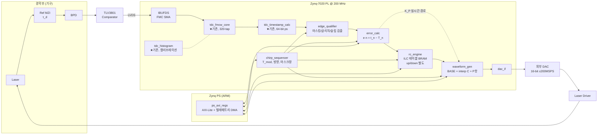

# EO-PLL 제어 블록 설계 (ZedBoard, 완전 디지털 파형직접출력 방식)

> 2026-07-22 초안. 근거: Hauser 2022 (수식/RC 구조), Schnuck 2025 (파형 액추에이터 구조), 본 저장소 TDC 코드 실측 결과.

---

## 1. 시스템 파라미터 (설계 기준값)

| 항목 | 값 | 비고 |
|---|---|---|
| 시스템 클럭 | 200 MHz (T_clk = 5 ns) | 기존 TDC와 동일 도메인 |
| Beat 주파수 f_b | ≤ 20 MHz (T_b ≥ 50 ns) | MZI 설계로 결정 |
| 변조 파형 | 삼각파, T_mod = 100~400 µs (프로그래머블) | 예시 계산은 200 µs (5 kHz) |
| DAC | ≤ 200 MSPS, **16-bit 권장** | 부품 미정 (§8 결정 대기) |
| TDC 분해능 | ~15.6 ps/tap (320 taps / 5 ns), 캘리브레이션 후 | 기존 tdc_fmcw_core 실측 기반 |
| TDC dead time | 3 clk = 15 ns | 50 ns beat 주기 처리 가능 ✅ |
| chirp당 에지 수 N | f_b·T_mod/2 = 최대 ~4000 | 보정 테이블 depth 4096 |

**제어 수식 (확정됨):**
```
e(n)      = t_n − T_n ,   T_n = t_anchor + n·T_b        … TDC 위상오차
ν_nl(t_n) = −γ·e(n)                                      … 주파수오차 복원
C_{k+1}[j] = Q{ C_k[j] + K_RC·e_k(j+D) }                 … 파형 ILC 갱신 (chirp k → k+1)
DAC[m]    = BASE[m] + interp(C[j(m)]) + K_P·e_live       … 출력 합성
```
γ/K_L 스케일은 전부 프로그래머블 이득 K_RC 하나로 접어 넣는다 (수렴 조건이 이득 오차에 관대하므로 정밀 측정 불필요).

---

## 2. 최상위 블록도



ASCII 버전 (미리보기가 mermaid를 지원하지 않을 때):

```
 Laser ──► MZI(τ_d) ──► BPD ──► TLV3801 ──LVDS/SMA──► IBUFDS
                                                        │ hit
   ┌────────────────────────────────────────────────────▼─────────┐
   │  FPGA (200 MHz 단일 도메인)                                    │
   │  tdc_fmcw_core ─► tdc_timestamp_calc ─► edge_qualifier        │
   │   (★기존)           (★기존, 64b ps)        │ t_n, n           │
   │                                          error_calc ──────┐   │
   │        chirp_sequencer ──(방향/마스크/동기)──┤  e(n)        │   │
   │              │                           rc_engine        │   │
   │              │                        (ILC BRAM ×2)   K_P 경로 │
   │              ▼                               │             │  │
   │        waveform_gen ◄────── interp(C[j]) ────┴─────────────┘  │
   │              │ BASE[m] + corr + P                             │
   │           dac_if                                              │
   └──────────────┼────────────────────────────────────────────────┘
                  ▼
            DAC(16b) ─► Laser Driver ─► Laser   (루프 폐쇄)
```

---

## 3. 모듈별 사양

### 3.1 재사용 모듈 (기존 코드)

| 모듈 | 역할 | 변경사항 |
|---|---|---|
| [tdc_fmcw_core.v](../tdc_fmcw_core.v) | 캐리체인 TDC (coarse 32b + fine 9b) | 없음. hit 입력만 IBUFDS 출력으로 연결 (hit 네트에 다른 부하 금지 — LED 교훈 유지) |
| [tdc_timestamp_calc.v](../tdc_timestamp_calc.v) | 캘리브레이션 ROM 적용, 64-bit 절대시간(ps) | 없음 |
| [tdc_histogram.v](../tdc_histogram.v) | code-density 캘리브레이션 | 운용 중 주기적 재캘리브레이션 경로로 승격 (온도 드리프트 대응) |
| [phase_shifter.v](../phase_shifter.v) | MMCM 위상 스윕 (INL 검증) | 검증 전용 유지, 제어 루프 미포함 |
| tdc_test_top.v | 테스트 하니스 | `eopll_top.v`(신규)로 대체, Mode 2 경로만 계승 |

### 3.2 edge_qualifier (신규)

TDC 타임스탬프를 제어에 쓸 수 있는 "유효 에지"로 거른다.

```
입력 : timestamp_ps[63:0], ts_valid, chirp 상태(방향, mask_active), 파라미터(T_b, mask폭)
출력 : t_n[63:0], edge_valid, edge_idx n[12:0], slip_flag, chirp_abort
```

| 기능 | 규칙 |
|---|---|
| 꼭짓점 마스킹 | chirp_sequencer의 `mask_active` 구간(꼭짓점 전후 M beat 주기, 프로그래머블) 동안 에지 폐기 + `edge_idx` 리셋/재앵커 |
| 글리치 제거 | Δt = t_n − t_{n−1} < T_b/4 → 폐기 (비교기 chatter) |
| cycle-slip 검출 | \|Δt − T_b\| > T_b/2 → `slip_flag`. 발생 시 해당 chirp의 RC 갱신 전체 무효화(`chirp_abort`) — 오염된 학습 방지 |
| 에지 카운트 | 마스크 해제 후 첫 에지를 n=0 앵커로, 이후 n++ |

### 3.3 error_calc (신규)

```
입력 : t_n, edge_valid, n, 파라미터 T_b(Q32.16 ps)
출력 : e_n[23:0] signed (ps, 포화), seg_addr j[12:0], e_valid
```

- 기대시각은 곱셈 없이 **누산기**로 생성: `T_acc += T_b` (Q48.16). T_b의 16-bit 소수부가 없으면 4000 에지 누적 시 최대 ±2 ns 계통오차 발생 → 소수부 필수.
- 앵커: chirp마다 첫 유효 에지에서 `T_acc = t_0` 재설정 (절대 오프셋 제거, 논문1 방식).
- `e_n = t_n − T_acc`, ±2²³ ps (±8.4 µs) 포화.
- `j = n` (에지 1개 = 보정 세그먼트 1개).

### 3.4 rc_engine (신규) — 학습 핵심

```
입력 : e_n, e_valid, j, 방향(up/down), chirp_abort, 파라미터 K_RC(Q0.16), D_edge[7:0], α1(Q0.8)
출력 : corr_rd_data C[j] (Q16.9 signed, 25b), (재생용 read port)
BRAM : 테이블 2개(up/down) × 4096 × 25b ≈ 205 kb ≈ 6× RAMB36 (7020 총 140개 — 여유)
```

- **갱신 (에지마다, RMW)**: `C[j − D_edge] += (K_RC × e_n) >>> 16`
  - 루프지연 보상 D_edge = 전체 루프지연 ÷ T_b (에지 단위). 디지털 지연(TDC 10단 + qualifier/error ~4단 ≈ 70 ns)보다 **레이저 열응답 지연이 지배적**이므로 D_edge는 실측 후 레지스터로 튜닝.
  - 에지 간격 ≥ 10 clk, RMW는 3 clk → 처리량 여유 3배 이상.
- **Q-filter (chirp 경계에서 스무딩 패스)**: `C'[j] = α₁·C[j−1] + α₀·C[j] + α₁·C[j+1]`, `2α₁+α₀=1`
  - 4096 엔트리 패스 = 20.5 µs. 꼭짓점 마스크 창(수 µs)보다 길 수 있으므로 **재생 포인터보다 앞서 달리는 스트리밍 패스**로 구현 (경계 직후 j=0부터 순차 진행, 재생은 세그먼트당 ~10 DAC 샘플이라 추월 불가능 — 마진 계산: 패스 1 엔트리/clk vs 재생 1 엔트리/10 clk).
- **DC 앵커링**: 패스 중 이동합으로 평균 계산 → 다음 chirp에 평균 제거. 파형이 mode-hop-free 창을 이탈하는 드리프트 차단.
- `chirp_abort` 시 해당 chirp의 갱신분 롤백은 하지 않고 **갱신 자체를 건너뜀** (단순화 — slip은 드물고 다음 chirp이 복구).

### 3.5 chirp_sequencer (신규)

- T_mod 카운터, up/down 방향, `chirp_start`/`apex` 스트로브, 꼭짓점 전후 마스크 창 생성.
- **T_mod 고정** (논문2와 달리 주기 불변 — DC 자유도는 rc_engine의 앵커링이 흡수).

### 3.6 waveform_gen (신규)

```
출력 합성: DAC[m] = BASE(m) + C_interp(m) + K_P·e_live   → 16b 포화
```

- **BASE**: 위상 누산기로 삼각파 생성 (BRAM 불필요). 추후 정적 predistortion 파형으로 교체 시 BRAM 옵션 (PS에서 런타임 로드 — 논문2 방식).
- **보정 보간**: 세그먼트 진행 누산기 `frac += T_s/T_b` (Q0.16) → `C_interp = C[j]·(1−frac) + C[j+1]·frac`. 세그먼트당 ~10 DAC 샘플의 계단을 제거.
- **K_P 실시간 경로** (옵션, 2단계 브링업부터): 최신 e_n을 즉시 출력에 가산. 대역폭은 레이저 FM 응답 위상반전(수백 kHz) 아래로 제한 — 기본은 K_P=0, RC 단독.

### 3.7 dac_if (신규, 부품 확정 후)

- 병렬 CMOS/LVDS 16-bit, 클럭은 200 MHz 계열 정수분주(50~200 MSPS)로 **동일 MMCM에서 생성 → CDC 없음**.
- 요구: 단조성(글리치 에너지 낮을 것), 정착시간 < T_b.

### 3.8 ps_axi_regs (신규)

| 레지스터 | 용도 |
|---|---|
| T_b, T_mod, 마스크폭 M | 루프 상수 |
| K_RC, K_P, α₁, D_edge | 제어 튜닝 (논문2의 UI처럼 런타임 조정) |
| enable/freeze/table_clear | 운용 제어 |
| 텔레메트리 | e(n) 스트림(AXI-Stream DMA), C[] 스냅샷, slip 카운트, 히스토그램 readout |

e(n) 스트림이 **성능지표 그 자체** (논문1 Fig.8의 rms 위상오차) — 첫날부터 DMA 경로를 뚫어놓을 것.

---

## 4. 수치 검증 (f_b = 20 MHz, T_mod = 200 µs, B = 5 GHz 예시)

| 항목 | 값 | 판정 |
|---|---|---|
| γ = B/(T_mod/2) | 5×10¹³ Hz/s | |
| 주파수오차 분해능 γ·δt (δt=16 ps) | 0.8 kHz | B 대비 1.6×10⁻⁷ ✅ |
| 위상 분해능 2π·f_b·δt | 0.115° | 에지 2000개 평균+RC 학습으로 논문1의 0.015° 도달권 ✅ |
| 에지율 20 MHz vs dead time 15 ns | 여유 3.3× | ✅ |
| RC RMW 3 clk vs 에지간격 10 clk | 여유 3.3× | ✅ |
| BRAM 사용량 (테이블+히스토그램+ROM) | < 10% | ✅ |
| Q-filter 패스 20.5 µs vs 재생 추월 | 10× 마진 | ✅ |

---

## 5. 브링업 단계 (권장 순서)

1. **개루프 계측**: waveform_gen(삼각파) → DAC → 레이저, TDC는 e(n) 기록만. → γ_실측/K_L 추정, D 실측, cycle-slip 빈도 확인
2. **RC 단독 폐루프** (K_P=0): 수 chirp 내 e_rms 수렴 확인 — 핵심 마일스톤
3. **K_P 실시간 경로 추가**: chirp 내 외란 억제 개선
4. **성능 평가**: 잔류 ν_nl,rms, 1−r², (측정 MZI 추가 시) beat FWHM — 논문1/2 표와 직접 비교

## 6. 검증(시뮬레이션) 계획

- 행동 모델 테스트벤치: 비선형 튜닝 곡선 `ν(V) = K₁V + K₂V² (+열 저역응답 1차 IIR)` → MZI 위상 `2π·τ_d·ν(t)` → 에지 시각 생성 → hit 자극.
- 폐루프 시뮬레이션에서 chirp 반복에 따른 e_rms 수렴 곡선 확인 (K_RC 스윕, Q-filter 유/무 비교).
- 기존 Mode 0/1 (MMCM INL, code-density) 하니스는 TDC 회귀검증용으로 보존.

## 7. 리스크 → 담당 블록 매핑

| 리스크 | 대응 블록 |
|---|---|
| 비교기 chatter / cycle slip | edge_qualifier (글리치 필터 + slip abort) |
| 삼각파 꼭짓점 위상반전 | chirp_sequencer 마스크 + edge_qualifier |
| T_b 누산 계통오차 | error_calc Q48.16 누산기 |
| 파형 DC 드리프트 (mode-hop) | rc_engine DC 앵커링 |
| 레이저 FM 위상반전 (수백 kHz) | RC 학습이 우회, K_P는 저이득 제한 |
| TDC 온도 드리프트 | tdc_histogram 주기 재캘리브레이션 |
| RC 발산 (이득 과대) | K_RC 런타임 튜닝 + freeze 레지스터 |

## 8. 미결정 사항 (하드웨어 발주 전 확정 필요)

1. **DAC 부품 선정** — 16-bit 병렬 인터페이스, 50~200 MSPS급 (후보 예: LTC1668(16b/50M), DAC904(14b/165M), AD9726(16b/400M)). 분해능 > 속도 우선.
2. DAC 풀스케일 ↔ 드라이버 변조이득 정합 (아날로그 감쇠기 값) — K_L 실측 후.
3. FMC SMA 보드의 LVDS 페어 핀아웃 → xdc 작성.
4. 마스크 창 폭 M, T_b 초기값 — MZI τ_d 확정 후.
